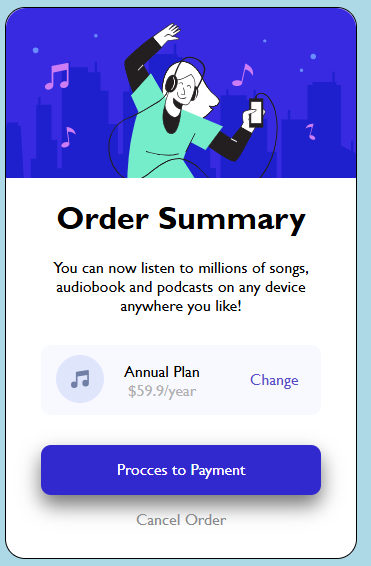

# 🎧 Order Summary Card – HTML & CSS Project

This project is a responsive **Order Summary UI component** built using **HTML and CSS**. It simulates a payment summary card with subscription details, pricing, and action buttons, perfect for UI practice or portfolio work.

## 🌐 Preview

## ✨ Features

- Beautifully styled UI card
- Music subscription plan summary
- "Change Plan" link
- "Proceed to Payment" button
- Fully responsive and centered layout
- Built using pure HTML & CSS

## 📁 Project Structure

📦 project-root/  
├── index.html  
├── style.css  
└── ACapture.PNG

## 💡 About the Project

> "You can now listen to millions of songs, audiobooks, and podcasts on any device anywhere you like!"

This component replicates a common e-commerce/payment interface — ideal for frontend learners and UI designers.

## 🛠️ Built With

- HTML5  
- CSS3

## 🧑‍💻 Author

**Your Name**  
[GitHub Profile](https://github.com/yourusername)

## 🚀 How to Use

1. Clone this repository:  
   `git clone https://github.com/yourusername/your-repo-name.git`

2. Open `index.html` in your browser to view the component.

---

💬 **Feedback is welcome!** Star ⭐ the repo if you find it useful!
